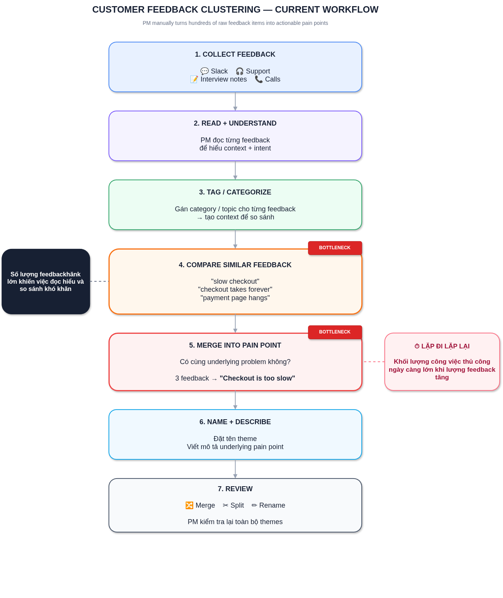
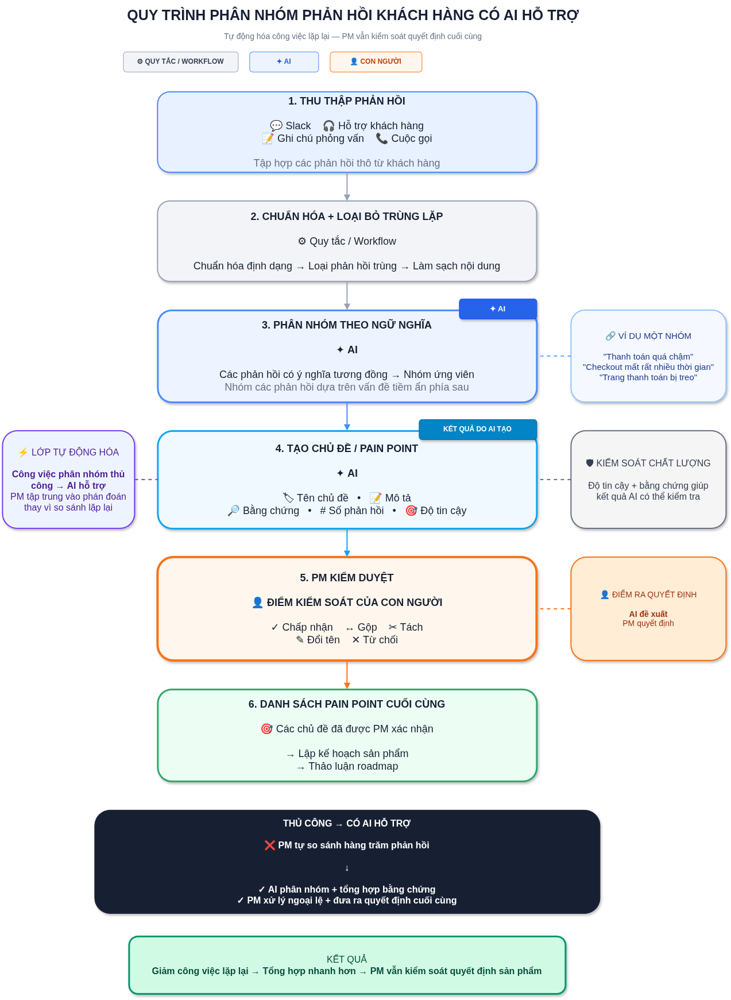

# 02 — Group Problem Statement (Bản nộp nhóm)

> Làm chung 1 bản, mỗi thành viên copy vào repo cá nhân. Đi theo Phase 3 → 6 trong `01-worksheet.md`. Nhóm chỉ chọn **candidate problem** ở Phase 3, viết Problem Statement sau khi validate + vẽ workflow.

## Thành viên nhóm

| STT | Họ và tên | Mã học viên | Vai trò trong nhóm (VD: facilitator, workflow, research, writer) |
|-----|-----------|-------------|---------------------------------------------------------------|
| 1   | Đào Đức Anh      | 2A202602567 | Nhóm trưởng |
| 2   | Trần Thu Phương  | 2A202602366 | Thành viên |
| 3   | Nguyễn Quốc Tuấn | 2A202602910 | Thành viên |
| 4   | Lê Tuấn Hưng     | 2A202602665 | Thành viên |
| 5   | Nguyễn Mạnh Hải  | 2A202602988 | Thành viên |

**Candidate problem nhóm chọn (1 câu):**

```text
PM phải xử lý lượng lớn customer feedback phân tán từ nhiều nguồn, khó nhận ra các feedback khác cách diễn đạt nhưng cùng underlying problem, dẫn đến clustering pain-point thủ công tốn thời gian và thiếu nhất quán.
```


---

## Phase 3 — Group Convergence: từ 9-12 candidates về 1

### 3.1. Trình bày top 3 mỗi người (mỗi candidate 1-2 phút)

| # | Người đưa ra | Candidate problem | Người gặp vấn đề | Điểm nghẽn | Cảm nhận nhanh của nhóm |
|---|---|---|---|---|---|
| 1 | Nguyễn Quốc Tuấn | Số hóa tài liệu giấy photo/sách in thành file Word | Sinh viên, nghiên cứu sinh | Vẽ lại khung bảng trong Word và copy-paste từng ô dữ liệu | Workflow rõ ràng, impact đo được tốt, dễ gặp lỗi nếu bảng phức tạp |
| 2 | Nguyễn Quốc Tuấn | Video call / nói chuyện online với đối tác nước ngoài | Sinh viên, Intern | Không theo kịp giọng nói nhanh hoặc accent lạ trong thời gian thực | Pain thật khi đi làm, nhưng xử lý audio real-time có latency cao |
| 3 | Nguyễn Quốc Tuấn | Viết báo cáo tuần của khoa / lab | Sinh viên, nghiên cứu sinh | Gom thông tin phân tán và viết tóm tắt khó khăn kỹ thuật | Lặp lại hàng tuần, dễ giải quyết bằng template kết hợp AI |
| 4 | Đào Đức Anh | PM phải gom feedback từ nhiều nguồn để tạo weekly insight | Product Manager | Tìm kiếm và tổng hợp thông tin phân tán từ Slack, Support, Call | Impact lớn (2–6h/tuần), bài toán quen thuộc của PM |
| 5 | Đào Đức Anh | PM phải tự nhóm các feedback giống nhau thành các pain point | Product Manager | Manual clustering + taxonomy không nhất quán; phân biệt wording khác nhau | Điểm nghẽn semantic rất rõ, cực kỳ phù hợp với AI, candidate mạnh nhất |
| 6 | Đào Đức Anh | PM phải kiểm chứng một "customer pain" bằng evidence từ nhiều nguồn | Product Manager | Cross-source investigation, truy vết context qua nhiều hệ thống | Giá trị cao cho roadmap nhưng scope rộng và phụ thuộc data access |
| 7 | Nguyễn Mạnh Hải | Luật sư rà soát hợp đồng (NDA) tìm điều khoản rủi ro thủ công | Luật sư, pháp chế | Đọc và đối chiếu từng điều khoản để phát hiện rủi ro | Impact lớn nhưng khó tiếp cận dữ liệu thật để validate trong lab |
| 8 | Nguyễn Mạnh Hải | Chuyên viên tín dụng thẩm định hồ sơ vay SME thủ công | Chuyên viên tín dụng | Thu thập và thẩm định báo cáo tài chính qua nhiều bước | Quy trình phức tạp, giá trị cao nhưng khó tiếp cận domain ngân hàng |
| 9 | Nguyễn Mạnh Hải | Ghi biên bản họp & theo dõi action item thủ công | PM, BA, thư ký | Chuyển note thô sang bản minute hoàn chỉnh và trích xuất task | Gần gũi, dễ làm nhưng impact thời gian tương đối nhỏ (~30 phút/buổi) |
| 10 | Lê Tuấn Hưng | Tự động phân rã yêu cầu tính năng thành user story và test case | BA, Tech Lead, PO | Phân tích logic đa bước và dự báo xung đột kiến trúc tiềm ẩn | Rất tham vọng, thể hiện rõ vai trò AI nhưng scope quá lớn cho lab |
| 11 | Lê Tuấn Hưng | Nghe lại recording/transcript cuộc họp để chắt lọc action items | Thành viên dự án, thư ký | Lọc thủ công các đoạn ghi âm dài, dễ sót việc không có keyword rõ | Nhu cầu thường xuyên, tối ưu tốt bằng LLM + workflow |
| 12 | Lê Tuấn Hưng | Viết mô tả Pull Request (PR description) và tóm tắt code diff | Software Developer | Tóm tắt ngữ cảnh thay đổi trong git diff cho người review | Hữu ích cho dev hàng ngày nhưng tính cấp thiết chưa vượt trội |
| 13 | Trần Thu Phương | Debug code/test mất nhiều thời gian do phải thử sửa nhiều lần | Sinh viên thực tập AI/Software | Phân tích traceback và context phân tán; thử sửa và test lặp lại | Nỗi đau thực tế của dev (20–40 phút/lỗi), impact đo lường rất rõ |
| 14 | Trần Thu Phương | Setup môi trường Python và xử lý dependency lặp lại | Sinh viên thực tập, dev mới | Cài đặt thủ công, xung đột package/version Python khó tìm nguyên nhân | Thường gặp nhưng Rule/Script (Docker, Conda) giải quyết tốt hơn AI |
| 15 | Trần Thu Phương | Hỏi mentor hỗ trợ debug bị thiếu thông tin nên phải hỏi qua lại | Sinh viên gặp lỗi, Mentor | Context debug thu thập không theo chuẩn, thiếu traceback và command | Pain giao tiếp thực tế, giải quyết được bằng format chuẩn hóa |

### 3.2. Gom trùng / cluster (gom 9-12 ý thành 3-4 cụm)

| Cluster | Candidates included | Pattern chung | Ghi chú |
|---|---|---|---|
| A | Research / tổng hợp thông tin — đọc paper dài để tìm key; tóm tắt paper tương tự; tra cứu docs thư viện AI | Đọc nhiều nguồn → tìm thông tin quan trọng → tổng hợp lại | |
| B | Báo cáo / chuyển đổi nội dung — viết báo cáo tuần; chuyển Word → slide; báo cáo tiến độ thiếu summary | Lấy nội dung/data có sẵn → cấu trúc → viết lại thành output cho người khác | |
| C | Meeting / follow-up — ghi meeting minutes; theo dõi action items; call với đối tác nước ngoài | Thu thập thông tin trong cuộc họp → ghi nhận → tổng hợp → follow-up | |
| D (nếu có) | Developer / Kỹ thuật & Debug — debug code/test; setup môi trường Python; viết mô tả Pull Request | Gặp lỗi phân tán, môi trường không đồng nhất → mất nhiều thời gian tra cứu và thử sửa thủ công | |
| E (nếu có) | Product feedback / PM operations — gom feedback từ nhiều nguồn; re-tag/regroup khi chuẩn bị roadmap; cluster feedback thành themes; tìm evidence cho pain point | PM phải xử lý lượng lớn thông tin phân tán → tìm pattern → tổng hợp thành insight để ra quyết định sản phẩm | Cluster được nhóm chọn tiếp tục cho Phase 4-6 |

### 3.3. Shortlist (giữ 2-3 bài trả lời được 7 câu hỏi worksheet)

| Candidate | Vì sao vào shortlist (2-3 ý) | Rủi ro / điều chưa rõ |
|---|---|---|
| PM — Tìm customer pain thật sự từ feedback phân tán | Actor rõ (PM); workflow tuyến tính 7 bước; bottleneck semantic rất rõ và phù hợp AI; human boundary rõ (Accept/Merge/Split/Rename/Reject) | Con số impact (~120 phút/tuần) mới là giả định ban đầu, chưa validate bằng dữ liệu thật từ một PM cụ thể |
| Weekly Report | Actor và workflow quen thuộc, lặp lại hàng tuần, dễ đo impact bằng thời gian viết báo cáo | Chưa có workflow chi tiết/case cụ thể; có thể trùng một phần với candidate PM (đều là tổng hợp thông tin định kỳ) |
| Debug Code & Automated Testing | Actor cụ thể (dev/sinh viên thực tập); impact đo lường rõ (20–40 phút/lỗi); pain có evidence thực tế | Domain kỹ thuật khá rộng, khó giới hạn AI intervention point cụ thể trong scope lab |

### 3.4. Score để đồng thuận (chấm 1-5, ép nói rõ vì sao cho 5 / cho 3)

| Candidate | Actor rõ | Workflow rõ | Pain có evidence | Impact đo được | Làm trong lab | So sánh R/W/A được | Nhóm hiểu domain | Có human boundary rõ | Tổng |
|---|---:|---:|---:|---:|---:|---:|---:|---:|---:|
| **PM — Tìm customer pain thật sự từ feedback phân tán** | **5** | **5** | **5** | **5** | **5** | **5** | **5** | **5** | **40** |
| Weekly Report | 5 | 5 | 4 | 5 | 5 | 5 | 5 | 4 | **38** |
| Debug Code & Automated Testing | 5 | 5 | 5 | 4 | 4 | 5 | 5 | 4 | **37** |
| Meeting Minutes + Action Items | 5 | 5 | 4 | 4 | 5 | 5 | 5 | 4 | **37** |
| Research / Paper Summarization | 5 | 4 | 5 | 4 | 5 | 4 | 4 | 4 | **35** |
| Word → Presentation Slides | 5 | 5 | 3 | 4 | 5 | 4 | 5 | 4 | **35** |
| Document / OCR Conversion | 4 | 4 | 4 | 4 | 5 | 3 | 4 | 4 | **32** |

**Vì sao "PM — Tìm customer pain thật sự từ feedback phân tán" đứng đầu?**

| Tiêu chí | Lý do |
|---|---|
| **Actor rõ** | PM là owner trực tiếp của workflow |
| **Workflow rõ** | Collect → Normalize → Cluster → Generate Theme → Review |
| **Pain rõ** | Semantic clustering và regroup feedback phải làm thủ công |
| **Evidence** | Hàng trăm feedback/tuần, khoảng **120 phút/tuần** theo giả định ban đầu |
| **Impact** | Clustering sai có thể làm sai frequency → ảnh hưởng prioritization |
| **AI fit** | Semantic similarity, clustering, theme generation và evidence extraction đều phù hợp với AI |
| **So sánh R/W/A** | Có thể phân biệt rõ: Rule xử lý deterministic → Workflow orchestration → Agent tự quyết định |
| **Human boundary** | PM có thể kiểm tra Accept / Merge / Split / Rename / Reject |
| **Lab fit** | Scope đủ nhỏ để pilot nhưng đủ phức tạp để đánh giá AI intervention |

**Candidate nhóm chọn (1 bài duy nhất):**

```text
PM — Tìm customer pain thật sự từ feedback phân tán
```

**Vì sao chọn (4-5 câu):**

```text
Lý do không chỉ vì điểm cao nhất, mà vì đây là candidate có đủ cả 4 yếu tố: workflow lặp lại + bottleneck semantic rõ + impact đo được + AI intervention point cụ thể, đồng thời cho phép nhóm kiểm chứng rõ quyết định Rule vs Workflow vs Agent. PM là actor rõ ràng với workflow tuyến tính (Collect → Normalize → Cluster → Generate Theme → Review), pain điểm nằm ở bước semantic clustering vốn phải làm thủ công. Impact đã có con số ước tính ban đầu (~120 phút/tuần) và có thể đo lại chính xác hơn khi pilot. Human boundary cũng rất rõ: PM luôn là người Accept/Merge/Split/Rename/Reject kết quả AI đề xuất.
```


## Phase 4 — Quick Validation + Research

### 4.1. Quick validation (ít nhất 1 cách: interview 2-3 người hoặc survey 5-10 người)

| Nguồn | Số người / mẫu | Tín hiệu xác nhận (kèm quote nguyên văn) | Tín hiệu phản bác | Nhóm sửa problem thế nào |
|---|---:|---|---|---|
| Interview | — | — | — | — |
| Survey / poll | — | — | — | — |
| Log / ticket / review (nếu có) | Research diễn đàn (Reddit) về pain point của PM | PM thường than phiền mất nhiều thời gian đọc và tổng hợp feedback từ nhiều nguồn để tìm ra các pain point trùng lặp | — | — |

**Insight sau validation (1-2 câu — pain thật nằm ở đâu):**

```text
Mỗi tuần PM mất khoảng 2 giờ đọc và nhóm hàng trăm customer feedback thành các pain point, trong đó việc xác định những feedback khác cách diễn đạt nhưng thực chất nói về cùng một vấn đề là bottleneck lớn nhất.
```

Bằng chứng đính kèm (nếu có): `02-group-problem-statement-survey.png`, `...-interview-notes.md`

### 4.2. Research giải pháp đã có (ít nhất 2-3 tools/patterns + 1-2 link kiểm được)

| Nguồn / tool / case | Link | Họ giải quyết bước nào? | Điểm mạnh | Khoảng trống / rủi ro | Bài học cho nhóm |
|---|---|---|---|---|---|
| Dovetail | [Dovetail Customer Intelligence](https://dovetail.com/) | Centralize feedback; AI tự động tìm themes/trends/signals; AI Channels cluster tickets, reviews, surveys | Bao phủ nhiều nguồn; semantic/AI analysis; có evidence gốc và citations | Là platform khá rộng; problem nhỏ hơn có thể không cần cả platform | Semantic clustering + evidence từ feedback là pattern đã được validate |
| Dovetail for Product Management | [Dovetail for Product Management](https://dovetail.com/roles/product-management/) | Automatically categorize/cluster feedback, quantify themes và đưa evidence vào roadmap | Gần như trùng trực tiếp với workflow của PM | Khó cạnh tranh nếu chỉ xây một clustering tool generic | Nếu build riêng, phải có specific workflow advantage thay vì chỉ "AI clustering" |
| Productboard | [Productboard Insights](https://www.productboard.com/product/insights/) | Thu thập feedback từ Slack, Zendesk, Gong... rồi capture/curate/route và identify actionable insights | Tích hợp feedback → product planning/roadmap | Nặng hơn nhu cầu "weekly clustering" đơn thuần | Giá trị không chỉ nằm ở clustering mà ở việc nối theme với product decision |
| Chattermill | [Chattermill AI-native CX Intelligence](https://chattermill.com/) | Unify feedback từ surveys, reviews, support, social, calls; AI tag/categorize và phát hiện themes | Xử lý volume lớn, theme taxonomy, context enrichment | Enterprise-oriented; có thể overkill cho một PM/team nhỏ | Taxonomy + semantic classification + context là pattern quan trọng |
| Productboard Spark | [Productboard Spark AI Feedback Analysis](https://www.productboard.com/blog/productboard-spark-ai-customer-feedback-analysis/) | Ingest feedback từ nhiều channel, tự detect themes và nối insights với features/roadmaps | Rất gần với AI-agent hypothesis ban đầu | Cho thấy "AI tự cluster feedback" đã là feature của incumbent | Agent nên giải quyết workflow end-to-end, không chỉ clustering |

**Research takeaway (2-3 câu — nên build gì / không build gì):**

```text
Productboard hiện mô tả rõ việc gom feedback từ các nguồn như Zendesk, Gong và Slack vào một nơi, sau đó dùng sorting/filtering/segmentation để phục vụ product decisions. Dovetail còn đi xa hơn: AI Channels có thể cluster raw feedback thành themes và rank theo frequency, sau đó cho phép PM đưa evidence vào Productboard/Jira. Chattermill cũng cho phép AI áp theme vào từng feedback và tổ chức theme theo category (vd category "Checkout experience" với theme con "Receipt/email confirmation").

Các sản phẩm hiện tại đã giải quyết theo pattern:
feedback → centralize → AI classification/clustering → theme → frequency/sentiment/evidence → product decision

Bài học cho nhóm: không nên build lại một "AI clustering" generic vì các incumbent đã làm rất tốt phần này; nếu build, giá trị khác biệt phải nằm ở việc gắn chặt với workflow cụ thể của nhóm (evidence rõ ràng, human boundary chặt) hơn là một tính năng clustering đơn thuần.
```

> Lưu ý: không dùng số liệu AI đưa nếu không verify được link chính thức. Ghi rõ giả định chưa chắc.

---

## Phase 5 — Workflow + Problem Statement

### 5.1. Current workflow bản nhóm



```text
[1 Collect feedback (Slack/Support/Interview/Calls): PM] → [2 Read + Understand: PM] → [3 Tag / Categorize: PM] → [4 Compare similar feedback: ~30-45' — BOTTLENECK] → [5 Merge into pain point: ~30-45' — BOTTLENECK] → [6 Name + Describe: ~15-20'] → [7 Review (Merge/Split/Rename): ~15-20']
```

| Bước | Actor | Input | Output | Thời gian / tần suất | Ghi chú (handoff? bottleneck?) |
|---|---|---|---|---|---|
| 1. Collect feedback | PM | Slack, support tickets, interview notes, calls | Raw feedback set | Hàng tuần | Feedback nằm rải rác ở nhiều nguồn |
| 2. Read + Understand | PM | Raw feedback | Hiểu context + intent từng feedback | Hàng tuần | Phải đọc hiểu ngữ cảnh, không chỉ lướt keyword |
| 3. Tag / Categorize | PM | Feedback đã đọc | Category/topic gán cho từng feedback | Hàng tuần | Tạo context để so sánh ở bước sau |
| 4. Compare similar feedback | PM | Tagged feedback | Candidate similarities (vd "slow checkout" / "checkout takes forever" / "payment page hangs") | ~30-45 phút | **Bottleneck** — số lượng feedback lớn khiến đọc & so sánh khó |
| 5. Merge into pain point | PM | Candidate similarities | Pain-point groups (vd 3 feedback → "Checkout is too slow") | ~30-45 phút | **Bottleneck** — phải phán đoán có cùng underlying problem không |
| 6. Name + Describe | PM | Pain-point groups | Tên theme + mô tả pain point | ~15-20 phút | Cần đặt tên có ý nghĩa |
| 7. Review | PM | Tất cả themes | Final themes (đã Merge/Split/Rename) | ~15-20 phút | PM kiểm tra lại toàn bộ trước khi chốt |

**Bottleneck chính (2-3 câu):**

```text
Bottleneck nằm ở bước 4-5 (Compare similar feedback & Merge into pain point): PM phải tự đọc, so sánh và phán đoán xem các feedback diễn đạt khác nhau có cùng underlying problem hay không. Đây là công việc lặp lại mỗi tuần, và khối lượng feedback càng lớn thì thời gian so sánh thủ công càng tăng.
```

### 5.2. Future workflow bản nhóm



Phải nhìn ra 5 thứ: bước nào máy (Rule), bước nào AI, bước nào người, boundary ở đâu, fallback khi AI sai.

```text
[1 Thu thập phản hồi: PM/Hệ thống] → [2 Chuẩn hóa + loại trùng: __' — máy (Rule/Workflow)] → [3 AI phân nhóm theo ngữ nghĩa: __' — AI] → [4 AI tạo chủ đề/pain point: __' — AI] → [5 PM kiểm duyệt (Accept/Merge/Split/Rename/Reject): ~15-20' — boundary] → [6 Danh sách pain point cuối cùng: gửi cho product planning/roadmap]

Fallback: nếu AI cluster không hợp lý → PM reject/split/merge → PM tự chỉnh cluster → final dataset vẫn do PM kiểm soát.
```

**Before/after impact:**

| Metric | Trước | Sau kỳ vọng | Cách đo |
|---|---:|---:|---|
| Tổng thời gian | ~120 phút/tuần | <30 phút/tuần | Đo tổng thời gian PM xử lý clustering mỗi tuần |
| Số bước | 7 | 6 | Đếm số bước trong workflow |
| Số bước thủ công | 7 (toàn bộ do PM) | 2 (Thu thập + PM kiểm duyệt), còn lại tự động hóa (Rule/AI) | Đếm số bước do người thực hiện toàn bộ |
| Bottleneck chính | Compare + Merge thủ công (bước 4-5) | PM review / merge / split (bước 5) | Quan sát bước nào chiếm nhiều thời gian nhất |
| Risk mới | Duplicate / merge nhầm feedback khác nhau | AI cluster sai / theme bị hallucinate | Theo dõi tỷ lệ PM phải sửa cluster/theme AI đề xuất |

### 5.3. Problem Statement v0 (mỗi field 2-3 câu)

| Field | Nội dung |
|---|---|
| **Actor** | Product Manager chịu trách nhiệm tổng hợp customer feedback để phục vụ product planning và roadmap review. |
| **Workflow** | Hằng tuần, PM thu thập feedback từ Slack, support tickets và interview notes, đọc từng feedback, phân loại, tìm các feedback có cùng underlying problem, gom thành pain-point clusters, đặt tên và review lại các nhóm. |
| **Bottleneck** | Việc xác định các feedback khác cách diễn đạt nhưng cùng underlying problem đòi hỏi PM phải đọc, so sánh và phán đoán thủ công; dễ tạo duplicate themes hoặc merge nhầm các vấn đề khác nhau. |
| **Impact** | Với vài trăm feedback mỗi tuần, workflow có thể tiêu tốn khoảng 2 giờ/tuần theo giả định ban đầu. Clustering không nhất quán cũng làm sai lệch frequency của pain points và có thể ảnh hưởng đến product prioritization. |
| **Success Metric** | Giảm thời gian clustering từ ~120 phút xuống <30 phút trên cùng một tập feedback; đạt ≥90% agreement với PM về cluster membership. |
| **Boundary** | AI chỉ đề xuất clusters, theme names và evidence; PM là người quyết định merge/split/rename/reject và phải review output trước khi sử dụng cho roadmap/product planning. |

**Câu hỏi AI phản biện v0 (nếu có):**
- Field nào mơ hồ:
- Tôi sửa gì:

---

## Phase 6 — Rule / Workflow / Agent + Decision

### 6.0. Ma trận độ phù hợp (suy nghĩ nhanh, không thay quyết định cuối)

- Độ mơ hồ: [ ] Thấp (có đúng/sai rõ) / [x] Cao (nhiều cách trả lời vẫn OK) — Vì sao: xác định 2 feedback khác wording có cùng underlying problem hay không là phán đoán ngữ nghĩa, không có đáp án tuyệt đối
- Độ phức tạp: [ ] Thấp (1-2 bước) / [x] Cao (3+ bước/nguồn, phụ thuộc nhau) — Vì sao: workflow có 7 bước, feedback đến từ 4 nguồn khác nhau (Slack, support, interview, calls) và các bước phụ thuộc tuần tự vào nhau

**Bài toán nhóm nằm ở ô nào:**

```text
Mơ hồ cao + Phức tạp cao (nhiều bước/nguồn), nhưng workflow đi theo đúng 1 trình tự cố định, không rẽ nhánh.
```

**Vì sao (2-3 câu):**

```text
Dù có nhiều bước và nhiều nguồn dữ liệu, workflow không rẽ nhánh — các bước luôn đi theo thứ tự Collect → Normalize → Cluster → Theme → Review. Độ mơ hồ nằm ở việc phán đoán ngữ nghĩa (2 feedback có cùng vấn đề không), đây là việc AI hỗ trợ tốt nhưng vẫn cần con người xác nhận. Vì không cần agent tự quyết định bước tiếp theo hay tự gọi thêm tool ngoài kế hoạch, Workflow + AI là đủ, chưa cần Agent.
```

### 6.1. So sánh Rule / Workflow / Agent (so trên cùng 1 bài)

| Mức | Phương án cho bài toán nhóm | Khi nào đủ | Rủi ro | Chọn? (Dùng cho bước nào?) |
|---|---|---|---|---|
| **Rule** | Fixed rule để thu thập feedback, chuẩn hóa format, loại duplicate, filter theo thời gian/nguồn | Đủ nếu bài toán chủ yếu là data processing có cấu trúc, không cần hiểu semantic meaning | Không hiểu được feedback khác wording nhưng cùng pain point; rule ngày càng nhiều và khó maintain | Không chọn làm toàn bộ, nhưng dùng cho Collect + Normalize + Dedupe |
| **Workflow** | Collect → Normalize → AI Semantic Clustering → AI Generate Theme → PM Review | Phù hợp khi quy trình tuyến tính, các bước tương đối cố định, AI chỉ xử lý các bước cần hiểu ngôn ngữ | AI clustering/theme có thể sai; cần PM kiểm duyệt; workflow phải xử lý exception | **Chọn** |
| **Agent** | Agent tự tìm feedback từ Slack/Support/Interview, quyết định cách phân tích, tự cluster/merge/split, yêu cầu thêm dữ liệu khi cần | Chỉ cần khi quy trình có nhiều nhánh, nhiều nguồn/tool và agent cần tự quyết định bước tiếp theo | Quá phức tạp, khó kiểm soát quyết định merge/split; nhiều quyền truy cập và khó audit | Chưa chọn |

**5 câu hỏi chốt (trả lời câu đầy đủ):**
1. Rule có giải được 70-80% case không?
2. Các bước có đi thẳng một đường không hay phải rẽ nhánh?
3. Có thật sự cần Agent tự lập kế hoạch + gọi tool không?
4. Nếu AI sai, ai phát hiện đầu tiên và sửa trong bao lâu?
5. Có hạ được từ Agent → Workflow → Rule không?

**Mức chọn:**

```text
Workflow (Rule cho phần deterministic + AI cho phần semantic, PM review cuối)
```

**Vì sao chọn (3-4 câu):**

```text
Bài toán hiện tại có workflow khá tuyến tính và predictable. Bottleneck nằm ở việc hiểu semantic similarity và tổng hợp feedback, nên AI nên được đặt vào đúng các bước đó thay vì dùng một Agent tự quyết toàn bộ quy trình. Rule xử lý phần deterministic (normalize, dedupe) → AI xử lý phần semantic (clustering, theme generation) → PM giữ quyền quyết định cuối cùng.
```

**Vì sao không chọn mức đơn giản hơn (2-3 câu):**

```text
Rule đơn thuần không hiểu được feedback khác wording nhưng cùng pain point, và số lượng rule sẽ ngày càng nhiều, khó bảo trì khi feedback đa dạng lên — nên không thể dùng Rule làm toàn bộ workflow, chỉ dùng cho phần chuẩn hóa/dedupe deterministic.
```

### 6.2. Problem Statement v1 (v0 sửa chặt hơn + 3 field cuối)

| Field | Nội dung |
|---|---|
| **Actor** | Product Manager chịu trách nhiệm tổng hợp customer feedback hằng tuần để xác định pain points và phục vụ product planning / roadmap review. |
| **Workflow** | Thu thập feedback từ Slack, support tickets, interview notes → chuẩn hóa & loại trùng → phân nhóm theo semantic similarity → tạo theme/pain point → PM review → đưa vào danh sách pain point cuối cùng. |
| **Bottleneck** | PM phải đọc và so sánh hàng trăm feedback để nhận ra các feedback khác cách diễn đạt nhưng cùng underlying problem. Đây là bước cần nhiều thời gian và phán đoán, đồng thời dễ xảy ra merge nhầm hoặc tạo duplicate themes. |
| **Impact** | Với vài trăm feedback mỗi tuần, PM có thể mất khoảng 120 phút/tuần cho việc clustering và tổng hợp. Clustering không nhất quán có thể làm sai frequency của pain points và ảnh hưởng đến product prioritization. |
| **Success Metric** | Giảm thời gian xử lý từ ~120 phút xuống <30 phút/tuần trên cùng một tập feedback; đạt ≥90% agreement với PM về cluster membership. |
| **Boundary** (làm / không làm) | AI chỉ đề xuất cluster, theme name, description và evidence. AI không tự quyết định merge/split/reject và không đưa output trực tiếp vào roadmap. PM phải review và quyết định cuối cùng. |
| **AI intervention point** (can thiệp sau bước nào, trước bước nào) | Sau bước Normalize + Dedupe, AI thực hiện Semantic Clustering + Generate Theme; sau đó chuyển output cho PM review. |
| **Mức chọn** (Rule / Workflow / Agent + 1 câu vì sao) | Workflow: Rule xử lý collect + normalize/dedupe; AI xử lý semantic clustering + theme generation; PM review và quyết định cuối cùng. |
| **Rủi ro & người thật kiểm tra** (rủi ro lớn nhất + ai kiểm tra bằng cách nào) | Risk: AI nhóm sai các feedback khác nhau, bỏ sót feedback, tạo theme không chính xác hoặc confidence không phản ánh đúng chất lượng. Người kiểm tra: PM review cluster membership, evidence và thực hiện merge/split/rename/reject trước khi sử dụng. |

### 6.3. Final decision

| Câu hỏi | Yes / Not Yet / No | Ghi chú (câu đầy đủ) |
|---|---|---|
| Actor + workflow rõ chưa? | Yes | Actor (PM) và workflow tuyến tính đã rõ: Collect → Normalize → Cluster → Theme → Review. |
| Baseline + metric đo được chưa? | Yes | Baseline ~120 phút/tuần; success metric là <30 phút/tuần và ≥90% agreement với PM. |
| Data/input đủ dùng chưa? | Yes | Có data mẫu 2-4 tuần feedback gần nhất để chạy pilot. |
| AI sai, hậu quả chấp nhận được không? | Yes | AI chỉ đề xuất, PM luôn review trước khi dùng nên rủi ro sai được kiểm soát. |
| Có người review/owner không? | Yes | PM là owner, thực hiện Accept/Merge/Split/Rename/Reject trên mọi output của AI. |
| Có cách non-AI đơn giản hơn không? | No | Rule đơn thuần không xử lý được semantic similarity (feedback khác wording, cùng vấn đề), nên cần AI ở đúng bước này. |

**Decision:**

```text
Go với scope nhỏ — AI-assisted workflow, không dùng Agent.
```

**Lý do (3-4 câu dựa trên bằng chứng):**

```text
Problem rõ: bottleneck tập trung ở semantic clustering. Workflow rõ và tuyến tính nên không cần Agent tự quyết định bước tiếp theo; có thể tách deterministic (Rule xử lý normalize/dedupe) và AI (xử lý semantic similarity) với AI intervention point rõ ràng. Human boundary rõ: PM vẫn chịu trách nhiệm quyết định merge/split/reject, metric đo được (thời gian xử lý + cluster agreement), và scope đủ nhỏ để pilot trước khi đầu tư một Agent phức tạp hơn.
```

**Nếu Go — pilot nhỏ nhất (data nào, chạy tay ra sao, đo 3 số nào):**

```text
Dùng data mẫu từ 2–4 tuần feedback gần nhất. Chạy workflow bán tự động: Collect → Normalize/Dedupe → AI Clustering → AI Theme Generation → PM Review. AI chỉ tạo: candidate clusters, theme name, description, evidence, feedback count, confidence. PM thực hiện Accept / Merge / Split / Rename / Reject.

Đo 3 số: (1) thời gian PM xử lý, (2) cluster agreement giữa AI và PM, (3) số lần PM phải sửa cluster/theme.
```

**Exit / rollback (khi nào dừng AI, quay về cách cũ):**

```text
Nếu sau 2 tuần pilot, PM vẫn phải chỉnh sửa >30% cluster membership hoặc không đạt ≥90% agreement, chưa triển khai rộng; quay về workflow rule/template + hỗ trợ thủ công. Nếu AI thường xuyên merge nhầm các pain point khác nhau, tăng human review hoặc giảm scope AI xuống chỉ đề xuất candidate clusters. Nếu AI tạo theme/evidence không đáng tin cậy, không cho output AI trở thành source of truth; PM phải xác nhận từ feedback gốc.
```

---

### Self-check nộp phần 02 (nhóm)
- [x] Có nhật ký hội tụ 9-12 → 1 (cluster + shortlist + score)
- [x] Có validation (quote thật) + research (link kiểm được)
- [x] Có workflow trước/sau đủ thời gian, handoff, bottleneck, boundary, fallback
- [x] Có PS v0 → v1, metric có trước/sau + cách đo, boundary có làm/không làm
- [x] Có so sánh Rule/Workflow/Agent + Decision Go/Not Yet/No-Go có lý do